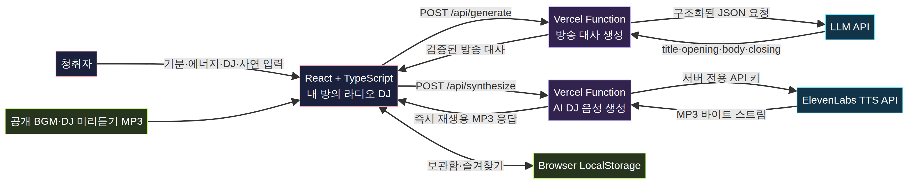

# 내 방의 라디오 DJ

> **지금, 당신의 방에서만 들리는 작은 방송.** 기분과 한 줄 사연을 입력하면 AI DJ가 개인화된 심야 라디오 대사와 음성으로 들려주는 반응형 웹앱입니다.



## 과제 제출 산출물

| 항목 | 위치 |
|---|---|
| 제품 요구사항 정의서(PRD) | `docs/prd/내방의라디오DJ_PRD.md` 및 PDF |
| 웹앱 설명서 | `docs/guide/내방의라디오DJ_웹앱설명서.md` 및 PDF |
| GitHub·Vercel 배포 가이드 | `docs/guide/GitHub_Vercel_배포가이드.md` |
| 아키텍처 원본·이미지 | `docs/architecture/room-radio-dj-architecture.mmd`, `.png` |
| 과제 요구 매핑 | `docs/submission-requirements.md` |

## 주요 기능

- 5가지 기분과 1~5 에너지 레벨, 4개 DJ 모드, 120자 한 줄 사연 입력
- Lily·Liam·River·Chris의 서로 다른 DJ 보이스 미리듣기
- LLM 기반 제목·오프닝·본문·클로징 생성과 불완전 응답 자동 재시도
- ElevenLabs TTS 기반 AI DJ 음성 자동 재생
- 기분별 BGM ON/OFF, 보관함(최대 20개), DJ·방송 즐겨찾기
- LocalStorage 기반 브라우저 내 재청취
- 375px 모바일 및 1280px 데스크톱 반응형 UI

## 기술 스택

React 19, TypeScript, Vite, Tailwind CSS, Node.js, Vercel Functions, Zod, Vitest, ElevenLabs Text-to-Speech API, OpenAI 호환 LLM API를 사용했습니다.

## 로컬 실행

```bash
pnpm install
pnpm dev
```

현재 개발 환경에서는 Manus 내장 LLM 경로를 보조적으로 지원합니다. 외부 배포 시에는 GitHub에 `.env` 파일을 만들지 말고, Vercel Dashboard의 **Settings → Environment Variables**에서 `OPENAI_API_KEY`와 `ELEVENLABS_API_KEY`를 직접 등록합니다.

## 테스트와 빌드

```bash
# 타입 검사
pnpm check

# 자동 테스트
pnpm test

# 현재 개발 서버용 빌드
pnpm build

# Vercel 배포용 정적 빌드
VERCEL=1 pnpm run build:vercel
```

## Vercel 배포

이 저장소를 GitHub에 올린 뒤 Vercel에서 Import합니다.

| Vercel 설정 | 값 |
|---|---|
| Framework Preset | Vite |
| Build Command | `pnpm run build:vercel` |
| Output Directory | `dist` |
| 필수 환경 변수 | `OPENAI_API_KEY`, `ELEVENLABS_API_KEY` |
| 선택 환경 변수 | `LLM_MODEL`, `OPENAI_BASE_URL` |

전체 단계와 Git Import 증빙 캡처 방법은 [배포 가이드](docs/guide/GitHub_Vercel_배포가이드.md)를 참고하세요.

## 보안 및 비용 안내

- API 키는 Vercel 환경 변수로만 관리하고, 클라이언트 코드·GitHub·문서에 넣지 않습니다.
- 음성 MP3는 서버리스 API가 즉시 브라우저로 전달하므로 과제 기본 흐름에는 별도 저장소 토큰이 필요하지 않습니다.
- LLM·ElevenLabs 사용량은 각 제공자의 별도 요금·크레딧 정책을 따릅니다.

## 제출 전 자리표시자

제출 전 PRD와 웹앱 설명서의 `[본인 이름으로 변경]`, `[GitHub 업로드 후 URL 입력]`, `[Vercel 배포 후 URL 입력]`을 실제 정보로 바꾸세요.
